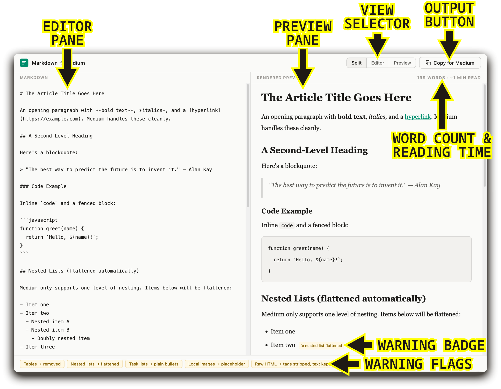

# “Markdown → Medium” Tool

Moving Markdown text into Medium can be a tedious process. Medium uses a bespoke What You See Is What You Get (WYSIWYG) editor that doesn’t translate Markdown syntax. After manually reformatting my first Medium post, I decided there had to be a better way. With LLM assistance, I created **Markdown → Medium**, which I am offering for free.

## What It Is

Markdown → Medium is a simple tool for converting Markdown files to a format that can be pasted directly into the Medium.com editor, requiring only minimal formatting changes there. It opens as a web page in a browser, but does not require an internet connection to function.

## Requirements

**The tool consists of three files**; all three files must be saved in the same folder to function:

- marked.min.js
- md-to-medium.html
- purify.min.js

**Markdown → Medium runs in a web browser**: 

- *Chrome* browsers work most reliably. I recommend *[Brave](https://brave.com/download/)* (`brew install --cask brave-browser`) or *[Ungoogled Chromium](https://ungoogled-software.github.io/ungoogled-chromium-binaries/)* (`brew install --cask ungoogled-chromium`).
- *Safari* and *Firefox* both work in my testing. I currently use *[Zen](https://zen-browser.app/download/)* (`brew install --cask zen`). If you have trouble using either Firefox or Safari, try a *Chrome-based* browser.

## Interface

## Workflow

1. Download the three files listed above (or the **Markdown_to_Medium.zip** file and extract into the same folder).
2. Open **md-to-medium.html** in a web browser.
3. Copy the plaintext Markdown from your editor and paste it into the left Editor pane.
4. **Warning Badges** appear inline in the Preview pane to alert you when unsupported elements are changed (see “Limitations” below). **Warning Flags** in the bottom bar collect all Warning Badges in one place for reference.
5. Once you have reviewed any warnings and made any necessary changes, click the “**Copy for Medium**” button to copy the result to the clipboard.
6. Paste (`Cmd/Ctrl+v`) into Medium’s editor. Warning Badges do not carry over, but local image placeholders will show in the editor to make replacing them easier.

## Limitations

The following features are not supported by the Medium editor:

- **Tables**—Tables are not supported; Medium will strip the table formatting. You will need to reformat tables as lists or replace them with images.
- **Nested list items and task items**—The Medium editor only supports simple lists with one level. All nested items will be promoted to top-level items, and task items will be changed to regular bullets.
- **Headers beyond H3**—Only H1, H2, and H3 are supported. Headers `####`+ are collapsed to `###`.
- **Local images**—Images hosted locally will not upload automatically and will need to be added in the Medium editor. Images linked online will be retained.
- **Raw HTML markup**—Elements such as `
` and `` are not supported and will be stripped.
- **Empty lines after blockquotes**—Medium’s editor adds an extra empty line at the end of blockquotes. This is a quirk of the editor.

## List of Markdown Elements and Support

- **Paragraphs** = Fully supported
- **Bold/Italic** `**text**`/`*text*` = Fully supported
- **Links** `[text](url)` = Fully supported
- **Headings H1–H3** `#`, `##`, `###` = Fully supported
- **Headings H4+** `####+` = Collapsed into H3 `###`
- **Unordered/Ordered Lists** `- Text`/`1. Text` = Fully supported (one level only)
- **Images, local** `` = Replaced with placeholder (alt text is preserved)
- **Images, remote** `` = Fetched by Medium editor
- **Blockquotes** `> Text` = Fully supported
- **Inline Code/Code Blocks** = Fully supported
- **Horizontal Rules** `---` = Becomes a divider (blank line with three dots)
- **Tables** = Not supported by Medium editor; table formatting stripped

## Important Notes

- Your content stays local; all processing is done on your device.
- The tool automatically sanitizes JavaScript, event handlers, and other potentially unsafe elements.
- The word count is based on the rendered text; it does not count the Markdown syntax.
- The reading time is based on an average reading speed of 265 words per minute.
